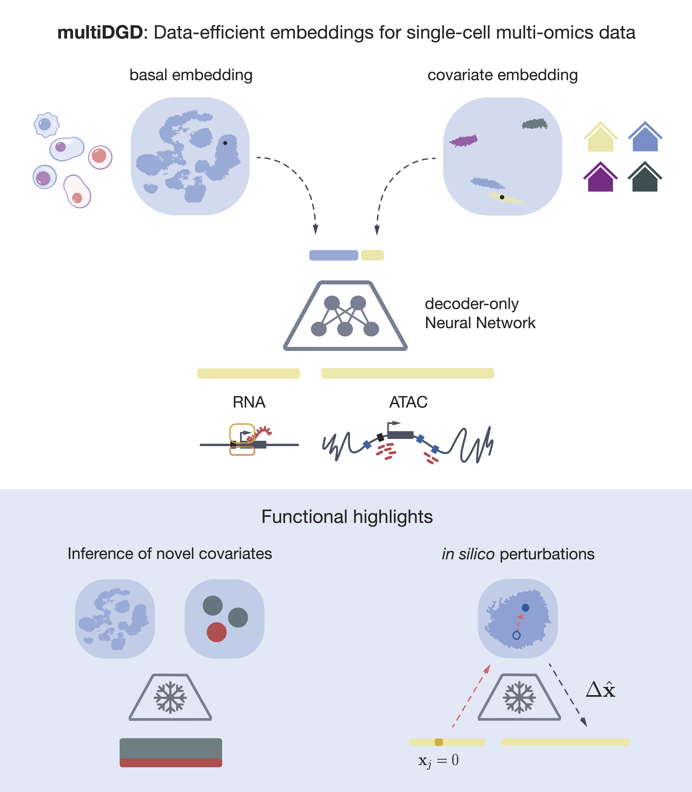

User Guide
==========

Here we guide you through how multiDGD works (high-level) and relate the math to the code. If you would like to know how to customize your model, check out our :doc:`tutorial <tutorials-folder/customization>`.

multiDGD is a generative model that learns a low-dimensional embedding from single-cell multi-omics data. It can be used for

* dimensionality reduction
* data integration
* modality prediction
* domain adaptation (integrating new data from unseen covariates)
* in silico perturbations of genes (gene2peak)

.. note::
    Detailed descriptions of the functionalities are coming soon.

|

multiDGD is an extension of the Deep Generative Decoder (DGD) for single-cell multiomics data. The core model consists of a decoder and a parameterized distribution over latent space. This is presented by a Gaussian Mixture Model (GMM) here. Since there is no encoder, inference of latent representations is achieved by learning representations as trainable parameters. multiDGD additionally offers the option of disentangled covariate representations. For this purpose, multiDGD learns a set of representations and distribution parameters for the basal state as well as each desired covariate.

Here you find chapters that guide you through how each component of multiDGD works:

.. toctree::
    :maxdepth: 2

    math/model
    math/customization
    math/troubleshooting